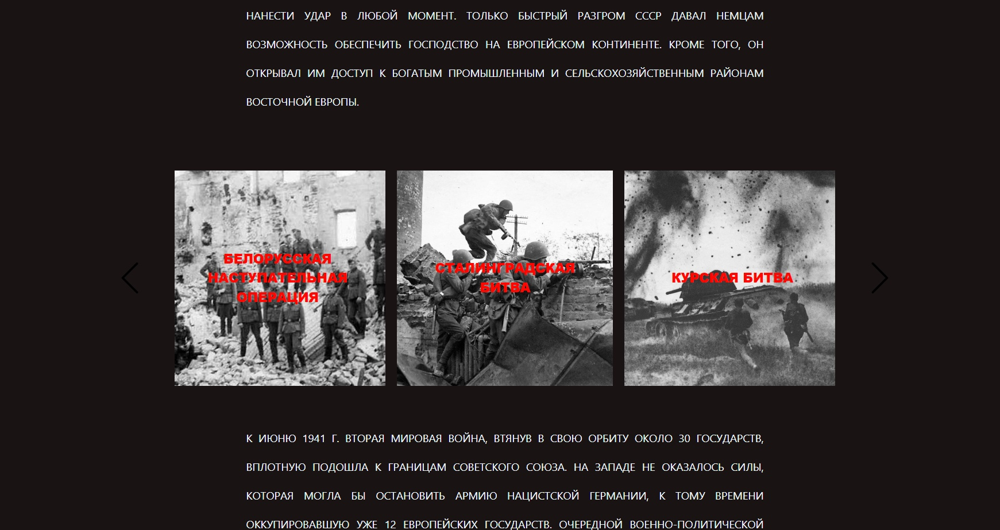
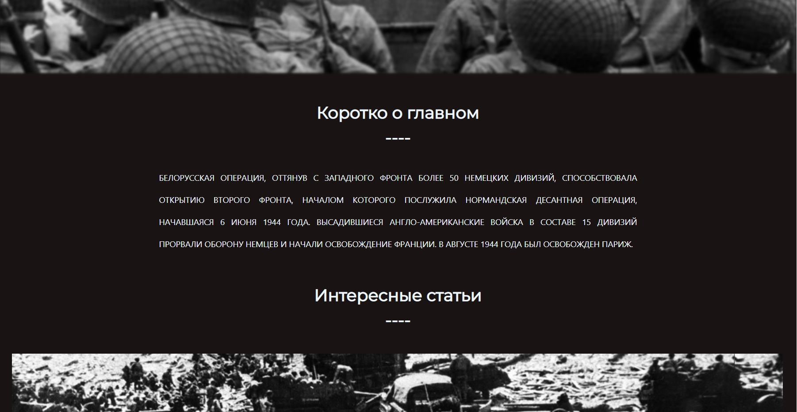
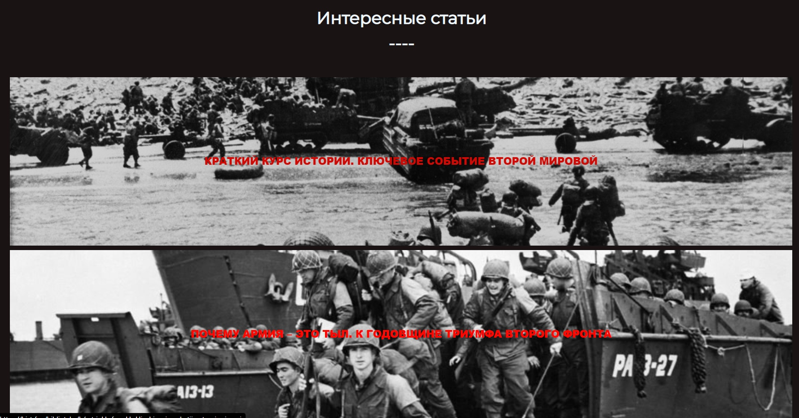
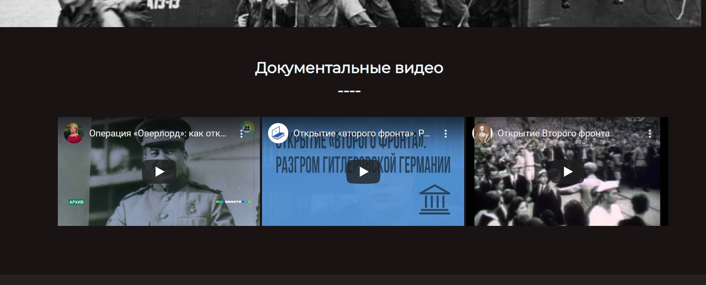

# Сайт 75 years of victory
    Данный сайт был написан для конкурса "Мой выбор - моё будущее: цифровое бужущее России", 8 Смена детского центра "ОРЛЁНОК".
 Цель сайта очень проста: Рассказать кратко и доступно про основные этапы ВОВ, а также предоставить материалы для самостоятельного обучения в этой теме.
#### Главня страница
 ​
 ​
 
 #### Страница со всеми ключевыми событиями
  ​
  ​
  
 #### Страница события
  ​
  ​
  ​
   ​
  
# Развертывание проекта:
    
   Для развертывания проекта необходим вебсервер с предустановленной OC Linux (Ubuntu) или созданной вертуальной машины в облаке.

   + Установка
   
    Выполните ред команд в консоли: 
        - sudo apt update
        - sudo apt install git
        - sudo apt install apt-transport-https ca-certificates curl software-properties-common
        - curl -fsSL https://download.docker.com/linux/ubuntu/gpg | sudo apt-key add -
        - sudo add-apt-repository "deb [arch=amd64] https://download.docker.com/linux/ubuntu bionic stable"
        - sudo apt update
        - apt-cache policy docker-ce
        - sudo apt install docker-ce
        - sudo curl -L https://github.com/docker/compose/releases/download/1.21.2/docker-compose-`uname -s`-`uname -m` -o /usr/local/bin/docker-compose
        - sudo chmod +x /usr/local/bin/docker-compose
        - sudo git clone https://github.com/MariaZyryanova72/Site_75_years_of_victory
        - cd Site_75_years_of_victory
        - sudo docker-compose up -d
    На этом установка проекта завершена. Перейдите в браузере по адресу вашего вебсервера.
Рабочий проект можете посмотреть на сайте http://victory.maxa-progy.ru
 

© 2020 by M@X@_progy